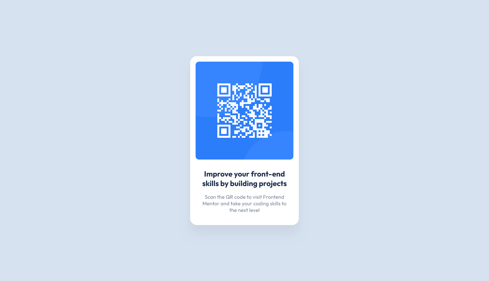

# Frontend Mentor - QR code component solution

This is a solution to the [QR code component challenge on Frontend Mentor](https://www.frontendmentor.io/challenges/qr-code-component-iux_sIO_H).

## Table of contents

- [Overview](#overview)
  - [Screenshot](#screenshot)
  - [Links](#links)
- [My process](#my-process)
  - [Built with](#built-with)
  - [What I learned](#what-i-learned)
- [Author](#author)
- [Acknowledgments](#acknowledgments)

**Note: Delete this note and update the table of contents based on what sections you keep.**

## Overview

### Screenshot

### Links

- Solution URL: [Github](https://github.com/LuisVera1/FrontendMentor-qr-code-component)
- Live Site URL: [Live Solution](https://frontend-mentor-qr-code-component-blush.vercel.app/)
## My process

### Built with

- Semantic HTML5 markup
- CSS custom properties
- Flexbox
- Mobile-first workflow
- [React](https://reactjs.org/) - JS library

### What I learned

This project was really simple, but I need to know it to be able to help the community.

## Author

- Website - [Luisvera.dev](https://www.luisvera.dev)
- Frontend Mentor -
  [@LuisVera1](https://www.frontendmentor.io/profile/LuisVera1)

## Acknowledgments

Thanks to Frontend Mentor
